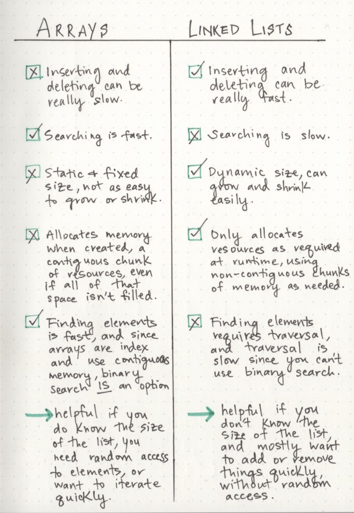

# Notes for Class 5 : DSA - Linked Lists

## Other Topics and Links - Code Fellows WriteUps

* [Big O : Analysis of Algorithm Efficiency](https://codefellows.github.io/common_curriculum/data_structures_and_algorithms/Code_401/class-05/resources/big_oh.html)
* [Linked Lists](https://codefellows.github.io/common_curriculum/data_structures_and_algorithms/Code_401/class-05/resources/singly_linked_list.html)

### Link Lists - Random Readings

* [What's a Linked List, Anyway pt1](https://medium.com/basecs/whats-a-linked-list-anyway-part-1-d8b7e6508b9d)
* [What's a Linked List, Anyway pt2](https://medium.com/basecs/whats-a-linked-list-anyway-part-2-131d96f71996)
  > '_citied references_'

#### Notes

* Data Structures
  * Linear
  * Non-Linear
  * Linked Lists have _Dynamic data structures_ where arrays and the like have _STATIC data structures_

* Important Considerations between Linear and Non-Linear
  * Memory management
    * Dynamic can grow and shrink. Adaptable
  * Big O - time and power for algorithm to execute
    > Some external factors affect the time it takes for a function to run: the speed of the processor, what else the computer is running, etc. So it’s hard to make strong statements about the exact runtime of an algorithm. Instead we use big O notation to express how quickly its runtime grows. _by Parker Phinney_

* Linked Lists (themselves...?)
  * _A single node is also pretty simple. It has just two parts: data, or the information that the node contains, and a reference to the next node._
  * **doubly** _linked list, because there are two references contained within each node: a reference to the next node, as well as the previous node_

