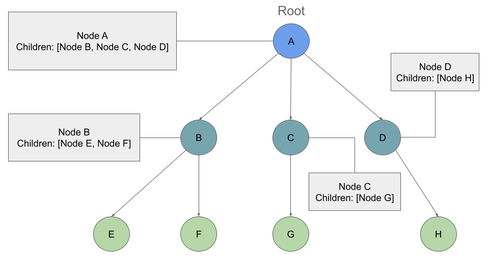

# Notes for Class 15 - DSA: Trees

## [TREES - Reading](https://codefellows.github.io/common_curriculum/data_structures_and_algorithms/Code_401/class-15/resources/Trees.html)

* TREES are everywhere
  * Binary Trees
  * Binary Search Tree
    * Binary has 2 children only
    * no specific sorting order for a binary tree
  * K-ary Trees
    * can have MORE than 2 child nodes

* Common Terminology
  
  * Node - Tree node is a component which may contain its own values, and references to other nodes
  * Root - The root is the node at the beginning of the tree
  * K - A number that specifies the maximum number of children any node may have in a k-ary tree. In a binary tree, k = 2.
  * Left - A reference to one child node, in a binary tree
  * Right - A reference to the other child node, in a binary tree
  * Edge - The edge in a tree is the link between a parent and child node
  * Leaf - A leaf is a node that does not have any children
  * Height - The height of a tree is the number of edges from the root to the furthest leaf

---
---

---
---

* Traversals
  * Depth First
    * Methods for 'depth first traversal'
      * __Pre-Order__: `root >> left >> right`
      * __In-Order__: `left >> root >> right`
      * __Post-Order__: `left >> right >> root`
      * > _The most common way to traverse through a tree is to use recursion. With these traversals, we rely on the call stack to navigate back up the tree when we have reached the end of a sub-path._
    * OUTPUTs:
      * __Pre-Order__: A, B, D, E, C, F
      * __In-Order__: D, B, E, A, F, C
      * __Post-Order__: D, E, B, F, C, A
  * Breadth First
    * Methods for 'breadth first'
      * layer by layer it is added and looks for any children
    * OUTPUT:
      * A, B, C, D, E, F

---
---

## K-ary Trees

* Breadth First
  * returns output: A, B, C, D, E, F, G, H
* Big O
  * O(n) because it has unlimited number of nodes

---
---

## Binary Search Trees (BST)

* Tree with some structure
  * all values that are smaller than the root are placed to the left, and all values that are larger than the root are placed to the right
* Traversing
  * while loop : compare the numbers because of structure
* Big O
  * O(h) based on height and needing to traverse the height of the list, not the breadth
  * worse if we go all the way down, O(1)
