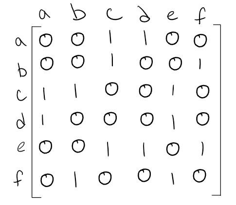
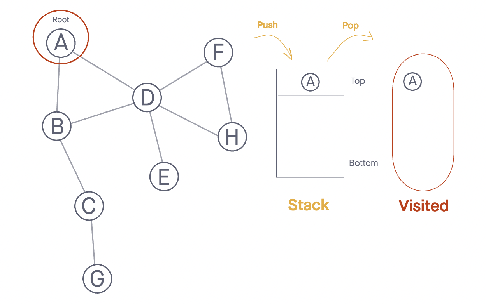
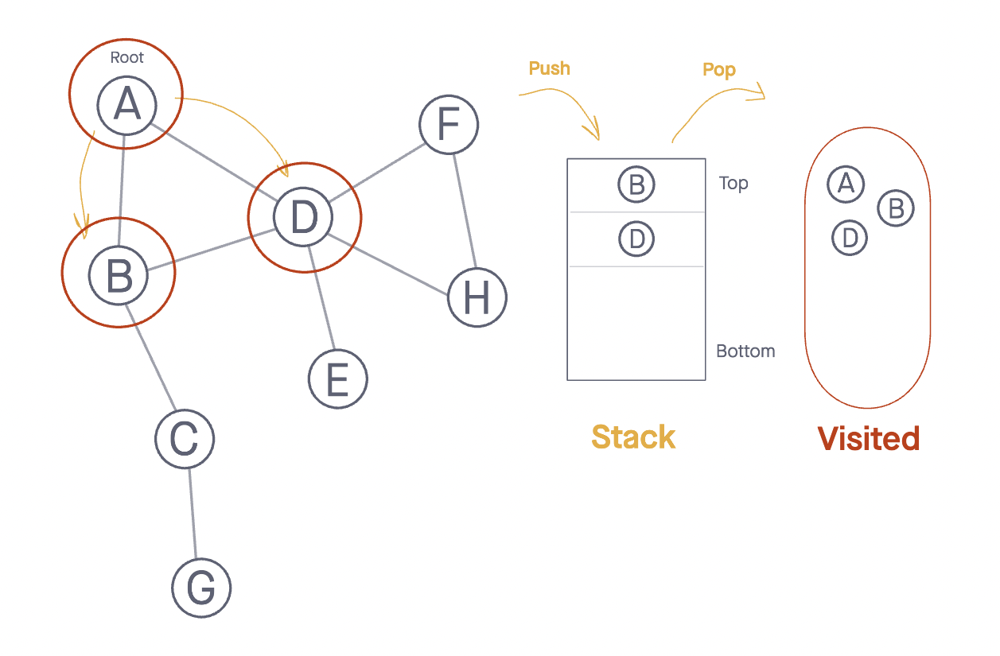
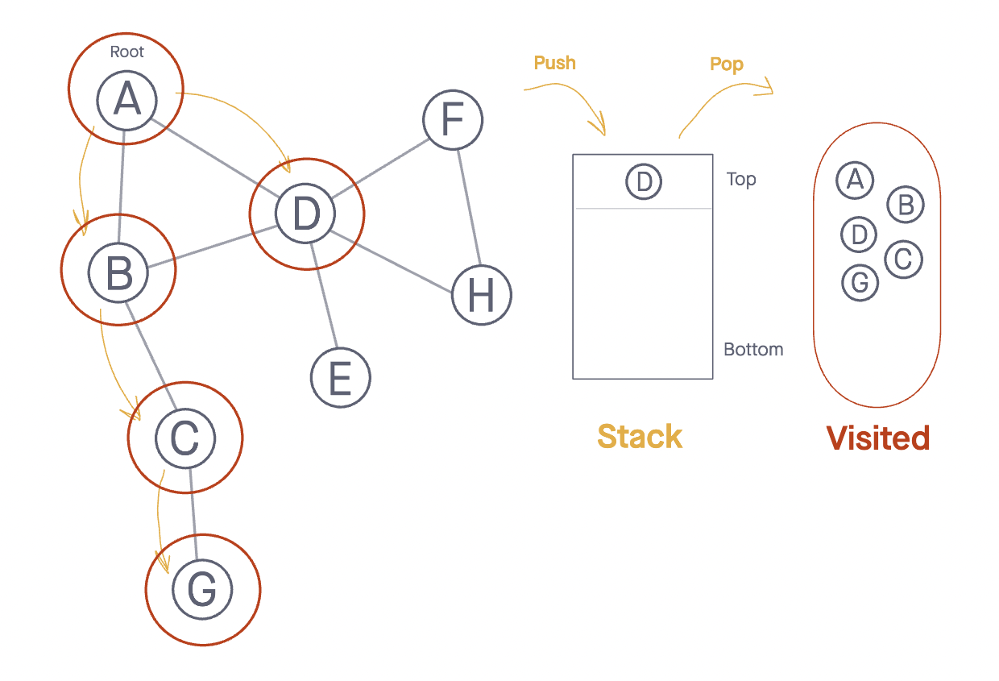
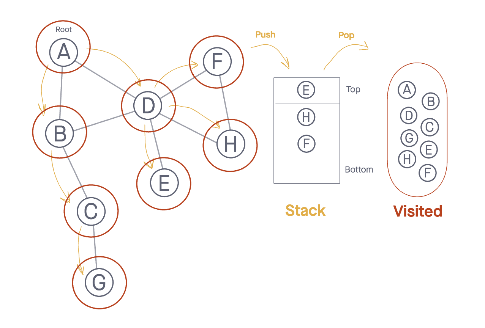
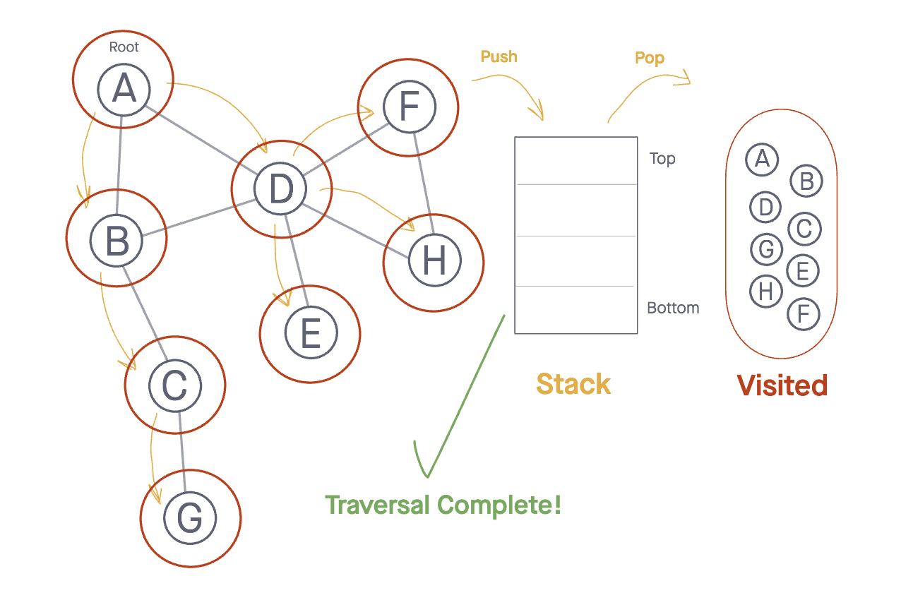

# Class 35 - DSA - Graphs

[Code Fellows Reference](https://codefellows.github.io/common_curriculum/data_structures_and_algorithms/Code_401/class-35/resources/graphs.html)

# Resources & Basic Info on Graphs

- [Graphs Reading](https://codefellows.github.io/common_curriculum/data_structures_and_algorithms/Code_401/class-35/resources/graphs.html)

> Graph is a _non-linear_ data structure that can be looked at as collection of vertices (_NODES_) connected by line segments _EDGES_

- Common Terms
    - Vertex - aka **NODE**, data object
    - Edge - connector between 2 **nodes**
    - Neighbor - adjacent **nodes** connected via _EDGE_
    - Degree - number of _EDGES_ connected to that _VERTEX_

## Directed vs Undirected

### Undirected

> each edge is undirected (bi-directional)


    - Verticles/Nodes = { a , b , c , d , e , f }
    - Edges = { (a,c) , (a,d) , (b,c) , (b,f) , (c,e) , (d,e) , (e,f) }

### Directed Graphs (Digraph)

> every edge is directed


    -Verticles = { a , b , c , d , e , f }
    -Edges = { (a,c) , (b,c) , (b,f) , (c,e) , (d,a) , (d,e) , (e,c) , (e,f) }

## Complete vs Connected vs Disconnected

### Complete Graphs

> all nodes are connected to other nodes


### Connected Graphs

> all verticles/Nodes have at least 1 edge


Looks like a 'tree'

### Disconnected Graph

> some verticles may NOT have edge


Can have stand alone Nodes ('islands')

## Acyclic vs Cyclic

Cycle is where you could traverse and end up back at itself

### Acyclic Graph

> **without** cycles


aka DAG (represented as 'tree')

### Cyclic Graph

> has cycles...


## Representation of Graphs

1. Adjacency Matrix
2. Adjacency List

Using the Undirected graph:

  

  - 
  - 

### Weighted Graphs

> numbers assigned to **edges** called weights


  - 
  - 

# Traversals

## Breadth First

Idea here is if the node has been 'visited' we need to know or you can be stuck in a loop
- Algo for **BreadthFirst()**
  - `Enqueue` the start node into `Queue`
  - create loop run while nodes present
  - `Dequeue` first node from `Queue`
  - if `Dequeue`'d node has unvisited child nodes, add to visited set and add to `Queue`


```js
ALGORITHM BreadthFirst(vertex)
    DECLARE nodes <-- new List()
    DECLARE breadth <-- new Queue()
    DECLARE visited <-- new Set()

    breadth.Enqueue(vertex)
    visited.Add(vertex)

    while (breadth is not empty)
        DECLARE front <-- breadth.Dequeue()
        nodes.Add(front)

        for each child in front.Children
            if(child is not visited)
                visited.Add(child)
                breadth.Enqueue(child)

    return nodes;
```
** notes: Islands will not be visited

## Depth First

Idea here is to use Recursive calls via Stack to visit all children in subtree
- Algo for **DepthFirst()**
  - `Push` the root into stack (mark as visited)
  - While loop that runs while stack is NOT empty
  - `Pop` the top node off and check neighbors
  - if unvisited, `Push` to stack and mark visited
  - repeat until *stack* is empty


  - 
  - 
  - 
  - 
  - 
